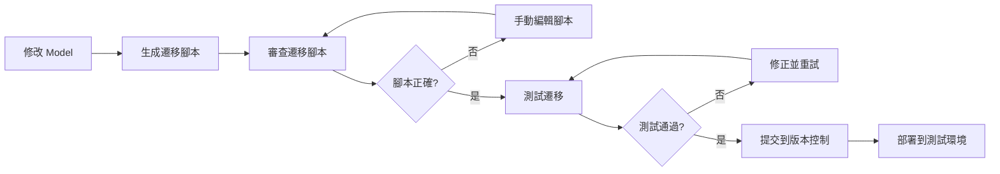

# EdgeSurvivor 資料庫遷移策略

**文件版本:** 1.0  
**更新日期:** 2025-11-05  
**狀態:** Active  
**用途:** 定義安全的資料庫遷移流程，確保資料完整性和向後相容性

---

## 1. 遷移工具：Flask-Migrate

### 1.1 工具選擇
- **工具：** Flask-Migrate (基於 Alembic)
- **版本：** 4.0.5+
- **原因：** 
  - Flask 官方推薦
  - 自動生成遷移腳本
  - 支援向上/向下遷移
  - 版本化管理

### 1.2 初始化步驟

**首次設定（僅執行一次）：**

```bash
cd backend

# 1. 確保已安裝依賴
pip install -r requirements.txt

# 2. 初始化 Flask-Migrate（會建立 migrations 目錄）
flask db init

# 3. 生成初始遷移腳本
flask db migrate -m "Initial migration"

# 4. 應用遷移到資料庫
flask db upgrade
```

**驗證初始化：**
```bash
# 檢查 migrations 目錄結構
ls migrations/
# 應該看到：versions/ alembic.ini env.py script.py.mako

# 檢查資料庫遷移版本
flask db current
```

---

## 2. 遷移工作流程

### 2.1 開發環境標準流程



### 2.2 詳細步驟

#### **步驟 1：修改資料模型**

```python
# 範例：在 models/user.py 新增欄位
class User(db.Model):
    # ... 現有欄位 ...
    nickname = db.Column(db.String(50))  # 新增欄位
```

#### **步驟 2：生成遷移腳本**

```bash
# 自動檢測模型變更並生成遷移
flask db migrate -m "Add nickname field to User model"

# 範例輸出：
# INFO  [alembic.runtime.migration] Context impl MySQLImpl.
# INFO  [alembic.autogenerate.compare] Detected added column 'users.nickname'
# Generating migrations/versions/abc123_add_nickname_field_to_user_model.py
```

#### **步驟 3：審查並編輯遷移腳本**

**⚠️ 重要：** 自動生成的腳本可能不完美，必須人工審查！

```python
# migrations/versions/abc123_add_nickname_field_to_user_model.py

def upgrade():
    # 檢查：是否需要預設值？
    op.add_column('users', sa.Column('nickname', sa.String(length=50), nullable=True))
    
    # 可能需要補充：為現有資料設定預設值
    # op.execute("UPDATE users SET nickname = name WHERE nickname IS NULL")

def downgrade():
    # 檢查：降級邏輯是否正確？
    op.drop_column('users', 'nickname')
```

**審查檢查清單：**
- [ ] `upgrade()` 邏輯正確
- [ ] `downgrade()` 邏輯正確（可回滾）
- [ ] 考慮現有資料的處理
- [ ] 索引和約束條件正確
- [ ] 外鍵關聯正確處理

#### **步驟 4：測試遷移**

```bash
# 1. 備份當前資料庫（重要！）
mysqldump -u user -p edgesurvivor > backup_before_migration.sql

# 2. 應用遷移（向上）
flask db upgrade

# 3. 驗證資料庫結構
flask db current
mysql -u user -p edgesurvivor -e "DESCRIBE users;"

# 4. 測試回滾（向下）
flask db downgrade -1

# 5. 驗證回滾成功
mysql -u user -p edgesurvivor -e "DESCRIBE users;"

# 6. 重新應用遷移
flask db upgrade
```

#### **步驟 5：提交版本控制**

```bash
git add migrations/versions/abc123_add_nickname_field_to_user_model.py
git commit -m "feat: Add nickname field to User model

- Add nullable nickname field (max 50 chars)
- Migration tested with upgrade/downgrade
- Backward compatible"
```

---

## 3. 生產環境遷移流程

### 3.1 部署前檢查清單

**必須項目：**
- [ ] 遷移腳本已在開發環境測試
- [ ] 遷移腳本已在測試環境驗證
- [ ] 完整的資料庫備份已完成
- [ ] 回滾計畫已準備
- [ ] 停機時間（如需要）已規劃並通知使用者
- [ ] 團隊成員已 Standby

### 3.2 零停機遷移策略

**適用情境：** 新增欄位、新增索引

```bash
# 階段 1：新增欄位（nullable）
flask db upgrade

# 階段 2：應用程式碼更新（支援新舊欄位）
git pull
systemctl restart edgesurvivor-backend

# 階段 3：資料遷移（背景執行）
# 將舊欄位資料複製到新欄位

# 階段 4：驗證新欄位資料完整

# 階段 5：更新應用程式碼（僅使用新欄位）

# 階段 6：移除舊欄位（下一個遷移）
```

### 3.3 需停機的遷移

**適用情境：** 刪除欄位、重命名欄位、變更資料類型

```bash
# 1. 維護模式：停止應用程式
systemctl stop edgesurvivor-backend

# 2. 最終備份
mysqldump -u user -p edgesurvivor > backup_final.sql

# 3. 執行遷移
flask db upgrade

# 4. 驗證遷移結果
flask db current
# 執行煙霧測試

# 5. 重啟應用程式
systemctl start edgesurvivor-backend

# 6. 監控錯誤日誌
tail -f /var/log/edgesurvivor/error.log
```

---

## 4. 回滾策略

### 4.1 快速回滾程序

**情境 1：遷移失敗（部署期間發現）**

```bash
# 立即回滾到前一版本
flask db downgrade -1

# 驗證回滾
flask db current

# 重啟應用程式
systemctl restart edgesurvivor-backend
```

**情境 2：遷移成功但應用程式有問題**

```bash
# 選項 A：資料庫回滾
flask db downgrade -1
git checkout previous_commit
systemctl restart edgesurvivor-backend

# 選項 B：從備份還原（如果回滾失敗）
systemctl stop edgesurvivor-backend
mysql -u user -p edgesurvivor < backup_before_migration.sql
git checkout previous_commit
systemctl start edgesurvivor-backend
```

### 4.2 回滾檢查清單

- [ ] 停止應用程式（避免資料不一致）
- [ ] 執行資料庫回滾或還原備份
- [ ] 回滾應用程式碼到前一版本
- [ ] 驗證資料完整性
- [ ] 重啟應用程式
- [ ] 執行健康檢查
- [ ] 通知團隊和使用者
- [ ] 記錄問題和學習點

---

## 5. 風險緩解措施

### 5.1 高風險操作

| 操作 | 風險等級 | 緩解措施 |
|------|---------|----------|
| **刪除欄位** | 🔴 嚴重 | - 先標記為棄用<br>- 確保無程式碼使用<br>- 完整備份<br>- 維護時段執行 |
| **重命名欄位** | 🔴 嚴重 | - 新增新欄位<br>- 複製資料<br>- 逐步遷移<br>- 最後刪除舊欄位 |
| **變更資料類型** | 🔴 嚴重 | - 測試資料轉換<br>- 驗證無資料遺失<br>- 考慮分階段遷移 |
| **刪除資料表** | 🔴 嚴重 | - 確保無外鍵依賴<br>- 完整備份<br>- 維護時段執行 |
| **新增欄位** | 🟡 中 | - 使用 nullable<br>- 提供預設值<br>- 測試向下相容 |
| **新增索引** | 🟡 中 | - 非尖峰時段執行<br>- 監控效能影響 |
| **新增資料表** | 🟢 低 | - 直接執行<br>- 無向下相容問題 |

### 5.2 資料完整性檢查

**遷移前檢查：**
```sql
-- 記錄資料表行數
SELECT 
    table_name, 
    table_rows 
FROM information_schema.tables 
WHERE table_schema = 'edgesurvivor';

-- 記錄關鍵統計
SELECT COUNT(*) as user_count FROM users;
SELECT COUNT(*) as activity_count FROM activities;
```

**遷移後驗證：**
```sql
-- 確認行數一致
SELECT 
    table_name, 
    table_rows 
FROM information_schema.tables 
WHERE table_schema = 'edgesurvivor';

-- 驗證新欄位
SELECT COUNT(*), COUNT(new_column) FROM table_name;

-- 檢查約束
SHOW CREATE TABLE table_name;
```

---

## 6. 常見情境處理

### 6.1 新增必填欄位到現有資料表

**錯誤做法：**
```python
# ❌ 會導致現有資料違反 NOT NULL 約束
op.add_column('users', sa.Column('phone', sa.String(20), nullable=False))
```

**正確做法：**
```python
def upgrade():
    # 步驟 1：新增為 nullable
    op.add_column('users', sa.Column('phone', sa.String(20), nullable=True))
    
    # 步驟 2：為現有資料設定預設值
    op.execute("UPDATE users SET phone = '0000000000' WHERE phone IS NULL")
    
    # 步驟 3：改為 NOT NULL（可選，或在下次遷移）
    # op.alter_column('users', 'phone', nullable=False)

def downgrade():
    op.drop_column('users', 'phone')
```

### 6.2 重命名欄位

**方法 1：兩階段遷移（推薦）**
```python
# 遷移 1：新增新欄位
def upgrade():
    op.add_column('users', sa.Column('full_name', sa.String(100)))
    op.execute("UPDATE users SET full_name = name")

# 遷移 2：刪除舊欄位（在確保程式碼不再使用後）
def upgrade():
    op.drop_column('users', 'name')
```

**方法 2：直接重命名（需停機）**
```python
def upgrade():
    op.alter_column('users', 'name', new_column_name='full_name')

def downgrade():
    op.alter_column('users', 'full_name', new_column_name='name')
```

### 6.3 資料遷移

```python
from alembic import op
import sqlalchemy as sa
from sqlalchemy import orm
from sqlalchemy.ext.declarative import declarative_base

Base = declarative_base()

class User(Base):
    __tablename__ = 'users'
    id = sa.Column(sa.Integer, primary_key=True)
    old_field = sa.Column(sa.String(50))
    new_field = sa.Column(sa.String(50))

def upgrade():
    # 新增欄位
    op.add_column('users', sa.Column('new_field', sa.String(50)))
    
    # 資料遷移
    bind = op.get_bind()
    session = orm.Session(bind=bind)
    
    for user in session.query(User).all():
        user.new_field = transform_data(user.old_field)
    
    session.commit()
```

---

## 7. 監控與警報

### 7.1 遷移執行監控

```bash
# 記錄遷移開始時間
echo "Migration started: $(date)" >> migration.log

# 執行遷移並記錄輸出
flask db upgrade 2>&1 | tee -a migration.log

# 記錄遷移結束時間
echo "Migration completed: $(date)" >> migration.log

# 檢查執行時間
# 如果超過預期時間，可能有效能問題
```

### 7.2 生產環境警報設定

- ⏱️ **遷移執行時間超過 5 分鐘** → 發送警報
- ❌ **遷移失敗** → 立即通知團隊
- 📊 **資料庫鎖定超過 30 秒** → 發送警報
- 🔍 **資料行數異常變化** → 觸發檢查

---

## 8. 最佳實踐

### 8.1 DO - 應該做的事

✅ **每次遷移只做一件事**
- 容易理解和審查
- 回滾更安全

✅ **編寫清晰的遷移訊息**
```bash
# 好的範例
flask db migrate -m "Add email_verified column to users table"

# 不好的範例
flask db migrate -m "update db"
```

✅ **總是測試 upgrade 和 downgrade**
```bash
flask db upgrade
# 測試功能
flask db downgrade -1
# 驗證回滾
flask db upgrade
```

✅ **保持遷移腳本在版本控制中**
```bash
git add migrations/versions/*.py
git commit -m "Add migration: ..."
```

✅ **在非尖峰時段執行重型遷移**

✅ **使用交易**
```python
def upgrade():
    with op.get_context().autocommit_block():
        # 遷移操作
        pass
```

### 8.2 DON'T - 不應該做的事

❌ **不要修改已部署的遷移腳本**
- 會導致版本不一致
- 如需修改，建立新的遷移

❌ **不要跳過測試**
- 總是在開發/測試環境先測試

❌ **不要在沒有備份的情況下遷移生產資料庫**

❌ **不要手動編輯生產資料庫 Schema**
- 總是透過遷移腳本

❌ **不要在遷移中使用硬編碼值**
```python
# 不好
op.execute("UPDATE users SET created_at = '2024-01-01'")

# 好
from datetime import datetime
op.execute(f"UPDATE users SET created_at = '{datetime.now()}'")
```

---

## 9. 故障排除

### 9.1 常見錯誤

**錯誤 1：遷移腳本衝突**
```
FAILED: Multiple head revisions are present
```

**解決方案：**
```bash
flask db merge heads -m "Merge migration heads"
flask db upgrade
```

**錯誤 2：資料庫與遷移版本不同步**
```
FAILED: Can't locate revision identified by 'abc123'
```

**解決方案：**
```bash
# 檢查當前版本
flask db current

# 手動標記資料庫版本（謹慎使用！）
flask db stamp head
```

**錯誤 3：遷移鎖定**
```
OperationalError: (1205, 'Lock wait timeout exceeded')
```

**解決方案：**
```sql
-- 檢查鎖定
SHOW PROCESSLIST;

-- 終止長時間執行的查詢
KILL <process_id>;
```

### 9.2 緊急恢復程序

**如果一切都失敗了：**

1. 停止應用程式
2. 從最近的備份還原資料庫
3. 回滾程式碼到穩定版本
4. 重啟應用程式
5. 驗證系統正常運作
6. 分析失敗原因
7. 準備修正方案

---

## 10. 檢查清單

### 10.1 開發環境遷移檢查清單

- [ ] 修改 Model 定義
- [ ] 執行 `flask db migrate -m "清晰的訊息"`
- [ ] 審查生成的遷移腳本
- [ ] 手動編輯腳本（如需要）
- [ ] 測試 `flask db upgrade`
- [ ] 驗證資料庫結構正確
- [ ] 測試 `flask db downgrade -1`
- [ ] 驗證回滾成功
- [ ] 重新執行 `flask db upgrade`
- [ ] 執行單元測試
- [ ] 提交到版本控制

### 10.2 生產環境遷移檢查清單

**部署前：**
- [ ] 遷移已在開發環境測試
- [ ] 遷移已在測試環境驗證
- [ ] 完整資料庫備份已完成
- [ ] 回滾計畫已準備
- [ ] 停機時間已規劃（如需要）
- [ ] 團隊成員已通知

**部署中：**
- [ ] 停止應用程式（如需要）
- [ ] 執行最終備份
- [ ] 執行遷移
- [ ] 驗證遷移結果
- [ ] 執行煙霧測試
- [ ] 重啟應用程式

**部署後：**
- [ ] 監控應用程式日誌
- [ ] 驗證資料完整性
- [ ] 檢查使用者回饋
- [ ] 記錄遷移詳情
- [ ] 更新文件

---

## 11. 相關文件

- [現有系統分析](./existing-system-analysis.md)
- [Epic 0: 專案基礎設施與環境設定](./epic/epic-0-專案基礎設施與環境設定.md)
- [資料庫 Schema 文件](./database-schema.md)（待建立）

---

**文件結束**

*最後更新：2025-11-05*
