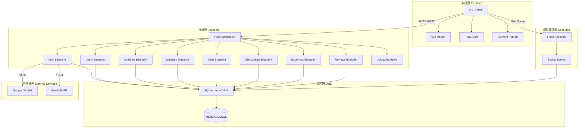
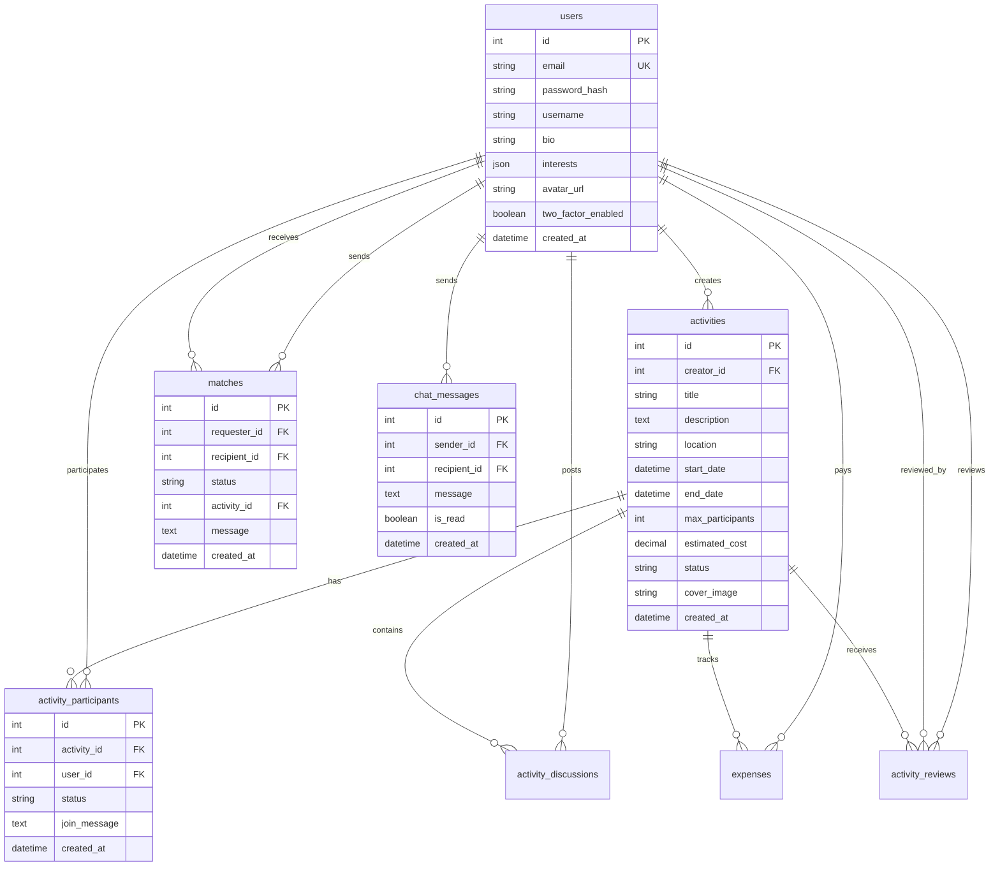

# EdgeSurvivor 現有系統分析文件

**文件版本:** 1.0  
**更新日期:** 2025-11-05  
**狀態:** Active  
**用途:** 為新開發者提供現有系統的完整概覽，識別整合點和潛在風險

---

## 1. 系統架構概覽

### 1.1 整體架構圖



### 1.2 技術棧清單

| 層級 | 技術 | 版本 | 用途 |
|------|------|------|------|
| **前端框架** | Vue.js | 3.3.8+ | UI 框架 |
| **UI 組件庫** | Element Plus | 2.4.2+ | UI 組件 |
| **狀態管理** | Pinia | 2.1.7+ | 全域狀態管理 |
| **路由** | Vue Router | 4.2.5+ | 前端路由 |
| **建置工具** | Vite | 4.5.3+ | 前端建置 |
| **HTTP 客戶端** | Axios | 1.6.0+ | API 請求 |
| **Socket 客戶端** | Socket.IO Client | 4.7.4+ | 即時通訊 |
| **後端框架** | Flask | 2.3.3 | Web 框架 |
| **ORM** | SQLAlchemy | 3.0.5 | 資料庫 ORM |
| **JWT** | Flask-JWT-Extended | 4.5.3 | 身份驗證 |
| **WebSocket** | Flask-SocketIO | 5.3.6 | 即時通訊 |
| **CORS** | Flask-CORS | 4.0.0 | 跨域支援 |
| **資料庫遷移** | Flask-Migrate | 4.0.5 | 資料庫版本管理 |
| **資料庫** | MariaDB/MySQL | 10.11/8.x | 關聯式資料庫 |
| **資料庫驅動** | PyMySQL | 1.1.0 | MySQL 驅動 |
| **Rate Limiting** | Flask-Limiter | 3.5.0 | API 速率限制 |
| **密碼加密** | Werkzeug (scrypt) | 2.3.7 | 密碼雜湊 |
| **2FA** | PyOTP | 2.9.0 | 雙因素認證 |

---

## 2. 已實作功能清單

### 2.1 功能與 Epic 對照表

| Epic | 功能模組 | 實作狀態 | 對應 Blueprint/View |
|------|----------|----------|---------------------|
| **Epic 1: 使用者認證** | 註冊/登入 | ✅ 完成 | auth.py |
| | JWT 驗證 | ✅ 完成 | auth.py |
| | Google OAuth2 | ✅ 完成 | auth.py |
| | 忘記密碼 | ✅ 完成 | auth.py |
| | 變更密碼 | ✅ 完成 | auth.py |
| | 2FA 雙因素認證 | ✅ 完成 | auth.py |
| | 帳號刪除 | ✅ 完成 | users.py |
| **Epic 2: 個人資料管理** | 編輯資料 | ✅ 完成 | users.py |
| | 頭像上傳 | ✅ 完成 | users.py, upload.py |
| | 隱私設定 | ✅ 完成 | users.py |
| | 個人統計儀表板 | ✅ 完成 | users.py |
| **Epic 3: 活動管理** | 建立活動 | ✅ 完成 | activities.py |
| | 瀏覽/搜尋/篩選 | ✅ 完成 | activities.py |
| | 查看活動詳情 | ✅ 完成 | activities.py |
| | 活動狀態管理 | ✅ 完成 | activities.py |
| | 申請加入活動 | ✅ 完成 | activities.py |
| | 審核申請 | ✅ 完成 | activities.py |
| | 離開活動 | ✅ 完成 | activities.py |
| **Epic 4: 媒合系統** | 推薦媒合 | ✅ 完成 | matches.py |
| | 建立媒合申請 | ✅ 完成 | matches.py |
| | 接受/拒絕媒合 | ✅ 完成 | matches.py |
| | 媒合狀態查詢 | ✅ 完成 | matches.py |
| **Epic 5: 即時通訊** | 私人聊天室 | ✅ 完成 | chat.py, socketio_events.py |
| | 活動討論串 | ✅ 完成 | discussions.py |
| | 訊息已讀狀態 | ✅ 完成 | chat.py |
| | 未讀計數 | ✅ 完成 | chat.py |
| **Epic 6: 費用分攤** | 新增費用記錄 | ✅ 完成 | expenses.py |
| | 查看費用列表 | ✅ 完成 | expenses.py |
| | 自動結算演算法 | ✅ 完成 | expenses.py |
| **Epic 7: 評價系統** | 互相評價 | ✅ 完成 | reviews.py |
| | 查看評價 | ✅ 完成 | reviews.py |
| | 評價狀態檢查 | ✅ 完成 | reviews.py |

---

## 3. API 端點完整清單

### 3.1 認證相關 (Auth Blueprint) - `/api/auth`

| 方法 | 端點 | 描述 | 認證需求 |
|------|------|------|----------|
| POST | `/register` | 使用者註冊 | ❌ |
| POST | `/login` | 使用者登入 | ❌ |
| POST | `/refresh` | 刷新 JWT Token | Refresh Token |
| GET | `/me` | 取得當前使用者資訊 | ✅ JWT |
| POST | `/logout` | 登出 | ✅ JWT |
| POST | `/change-password` | 變更密碼 | ✅ JWT |
| POST | `/google-login` | Google OAuth2 登入 | ❌ |
| POST | `/forgot-password` | 忘記密碼 | ❌ |
| POST | `/reset-password` | 重設密碼 | ❌ |
| POST | `/2fa/setup` | 設定雙因素認證 | ✅ JWT |
| POST | `/2fa/verify` | 驗證 2FA | ❌ |
| POST | `/2fa/disable` | 停用 2FA | ✅ JWT |

### 3.2 使用者相關 (Users Blueprint) - `/api/users`

| 方法 | 端點 | 描述 | 認證需求 |
|------|------|------|----------|
| GET | `/stats` | 取得使用者統計資料 | ✅ JWT |
| GET | `/recent-activities` | 取得最近活動 | ✅ JWT |
| GET | `/profile` | 取得個人資料 | ✅ JWT |
| PUT | `/profile` | 更新個人資料 | ✅ JWT |
| PUT | `/privacy` | 更新隱私設定 | ✅ JWT |
| GET | `/<int:user_id>` | 取得其他使用者資料 | ✅ JWT |
| POST | `/avatar` | 上傳頭像 | ✅ JWT |
| DELETE | `/account` | 刪除帳號 | ✅ JWT |

### 3.3 活動相關 (Activities Blueprint) - `/api/activities`

| 方法 | 端點 | 描述 | 認證需求 |
|------|------|------|----------|
| GET | `` | 瀏覽活動列表（支援搜尋/篩選） | ❌ |
| POST | `` | 建立新活動 | ✅ JWT |
| GET | `/<int:activity_id>` | 取得活動詳情 | ❌ |
| PUT | `/<int:activity_id>` | 更新活動 | ✅ JWT (創建者) |
| DELETE | `/<int:activity_id>` | 刪除活動 | ✅ JWT (創建者) |
| POST | `/<int:activity_id>/join` | 申請加入活動 | ✅ JWT |
| GET | `/<int:activity_id>/participants/pending` | 取得待審核申請 | ✅ JWT (創建者) |
| POST | `/<int:activity_id>/participants/<int:participant_id>/approve` | 批准申請 | ✅ JWT (創建者) |
| POST | `/<int:activity_id>/participants/<int:participant_id>/reject` | 拒絕申請 | ✅ JWT (創建者) |
| POST | `/<int:activity_id>/leave` | 離開活動 | ✅ JWT |

### 3.4 媒合相關 (Matches Blueprint) - `/api/matches`

| 方法 | 端點 | 描述 | 認證需求 |
|------|------|------|----------|
| GET | `/recommended` | 取得推薦媒合對象 | ✅ JWT |
| GET | `/pending` | 取得待處理媒合申請 | ✅ JWT |
| GET | `/sent` | 取得已發送的媒合申請 | ✅ JWT |
| GET | `` | 取得所有媒合記錄 | ✅ JWT |
| POST | `` | 建立媒合申請 | ✅ JWT |
| PUT | `/<int:match_id>/accept` | 接受媒合 | ✅ JWT |
| PUT | `/<int:match_id>/reject` | 拒絕媒合 | ✅ JWT |
| DELETE | `/<int:match_id>` | 刪除媒合 | ✅ JWT |

### 3.5 聊天相關 (Chat Blueprint) - `/api/chat`

| 方法 | 端點 | 描述 | 認證需求 |
|------|------|------|----------|
| GET | `/conversations` | 取得對話列表 | ✅ JWT |
| GET | `/<int:user_id>/messages` | 取得與特定使用者的訊息 | ✅ JWT |
| POST | `/messages` | 發送訊息 | ✅ JWT |
| PUT | `/messages/<int:message_id>/read` | 標記訊息已讀 | ✅ JWT |
| PUT | `/conversations/<int:user_id>/read` | 標記整個對話已讀 | ✅ JWT |
| GET | `/unread-count` | 取得未讀訊息數 | ✅ JWT |
| GET | `/shared-activities/<int:user_id>` | 取得共同參與的活動 | ✅ JWT |

### 3.6 討論串相關 (Discussions Blueprint) - `/api`

| 方法 | 端點 | 描述 | 認證需求 |
|------|------|------|----------|
| GET | `/activities/<int:activity_id>/discussions` | 取得活動討論串 | ✅ JWT (參與者) |
| POST | `/activities/<int:activity_id>/discussions` | 發送討論訊息 | ✅ JWT (參與者) |
| DELETE | `/discussions/<int:discussion_id>` | 刪除討論訊息 | ✅ JWT (本人或創建者) |

### 3.7 費用相關 (Expenses Blueprint) - `/api`

| 方法 | 端點 | 描述 | 認證需求 |
|------|------|------|----------|
| GET | `/activities/<int:activity_id>/expenses` | 取得活動費用列表 | ✅ JWT (參與者) |
| POST | `/activities/<int:activity_id>/expenses` | 新增費用記錄 | ✅ JWT (參與者) |
| DELETE | `/expenses/<int:expense_id>` | 刪除費用記錄 | ✅ JWT (本人或創建者) |
| GET | `/activities/<int:activity_id>/expenses/settlement` | 取得費用結算報告 | ✅ JWT (參與者) |

### 3.8 評價相關 (Reviews Blueprint) - `/api`

| 方法 | 端點 | 描述 | 認證需求 |
|------|------|------|----------|
| GET | `/activities/<int:activity_id>/reviews` | 取得活動評價列表 | ✅ JWT |
| GET | `/activities/<int:activity_id>/reviews/my-status` | 取得我的評價狀態 | ✅ JWT (參與者) |
| POST | `/activities/<int:activity_id>/reviews` | 提交評價 | ✅ JWT (參與者) |

### 3.9 檔案上傳相關 (Upload Blueprint) - `/api/upload`

| 方法 | 端點 | 描述 | 認證需求 |
|------|------|------|----------|
| POST | `/image` | 上傳單張圖片 | ✅ JWT |
| POST | `/images` | 上傳多張圖片 | ✅ JWT |

---

## 4. 資料庫 Schema

### 4.1 資料表清單

| 資料表名稱 | 對應 Model | 主要用途 |
|-----------|-----------|---------|
| `users` | User | 使用者基本資料 |
| `activities` | Activity | 活動資訊 |
| `activity_participants` | ActivityParticipant | 活動參與者關聯 |
| `matches` | Match | 媒合申請記錄 |
| `chat_messages` | ChatMessage | 私人聊天訊息 |
| `activity_discussions` | ActivityDiscussion | 活動討論串訊息 |
| `expenses` | Expense | 費用記錄 |
| `activity_reviews` | ActivityReview | 活動評價 |

### 4.2 核心資料表關聯圖



---

## 5. 整合點識別

### 5.1 Blueprint 模組整合點

| Blueprint | 職責 | 整合點 | 風險評估 |
|-----------|------|--------|----------|
| **auth.py** | 使用者認證 | - JWT Token 生成/驗證<br>- Google OAuth2 API<br>- Email SMTP | 🟡 中風險：OAuth 設定錯誤會導致第三方登入失敗 |
| **users.py** | 使用者資料管理 | - 檔案上傳服務<br>- 活動查詢 | 🟢 低風險：獨立性高 |
| **activities.py** | 活動管理 | - 參與者管理<br>- 討論串<br>- 費用<br>- 評價 | 🔴 高風險：核心模組，影響範圍廣 |
| **matches.py** | 媒合系統 | - 聊天室建立<br>- 推薦演算法 | 🟡 中風險：需確保媒合狀態一致性 |
| **chat.py** | 私人聊天 | - Socket.IO 事件<br>- 未讀計數快取 | 🟡 中風險：即時性要求高 |
| **discussions.py** | 活動討論串 | - Socket.IO 事件<br>- 權限檢查 | 🟢 低風險：邏輯簡單 |
| **expenses.py** | 費用分攤 | - 結算演算法<br>- 參與者資料 | 🟡 中風險：演算法準確性關鍵 |
| **reviews.py** | 評價系統 | - 活動狀態檢查<br>- 參與者驗證 | 🟢 低風險：獨立性高 |
| **upload.py** | 檔案上傳 | - 檔案系統<br>- 檔案驗證 | 🟡 中風險：安全性考量 |

### 5.2 Socket.IO 事件整合點

**檔案：** `backend/socketio_events.py`

| 事件名稱 | 方向 | 用途 | 風險 |
|---------|------|------|------|
| `connect` | Client → Server | 建立連線 | 🟢 低 |
| `disconnect` | Client → Server | 斷開連線 | 🟢 低 |
| `join_chat` | Client → Server | 加入聊天室 | 🟡 中 |
| `leave_chat` | Client → Server | 離開聊天室 | 🟡 中 |
| `send_message` | Client → Server | 發送訊息 | 🟡 中 |
| `new_message` | Server → Client | 接收新訊息 | 🟡 中 |
| `message_read` | Server → Client | 訊息已讀通知 | 🟢 低 |
| `typing` | Client ↔ Server | 輸入狀態 | 🟢 低 |

**風險說明：**
- 🔴 高風險：需要嚴格的錯誤處理和回滾機制
- 🟡 中風險：需要測試但影響範圍可控
- 🟢 低風險：影響範圍小或有完善的錯誤處理

### 5.3 外部服務整合點

| 服務 | 整合方式 | 配置需求 | 失敗影響 |
|------|---------|---------|---------|
| **Google OAuth2** | `requests` 庫調用 Google API | - Client ID<br>- Client Secret | 第三方登入功能失敗 |
| **Email SMTP** | Flask-Mail (待確認) | - SMTP 伺服器<br>- 帳號密碼 | 無法發送驗證信/重設密碼信 |
| **Redis** (可選) | Flask-Limiter 後端 | - Redis URL | Rate Limiting 使用記憶體模式 |

---

## 6. 部署架構

### 6.1 Docker Compose 架構

```yaml
services:
  db:
    - MariaDB 10.11
    - 資料持久化
  
  backend:
    - Flask Application
    - 依賴 db 服務
    - 埠: 5000
  
  frontend:
    - Vue 3 應用 (生產環境需建置)
    - 或使用 Nginx 服務靜態檔案
```

### 6.2 環境變數需求

**必要變數：**
- `SECRET_KEY` - Flask 密鑰
- `JWT_SECRET_KEY` - JWT 密鑰
- `DB_HOST`, `DB_USER`, `DB_PASSWORD`, `DB_NAME` - 資料庫連線
- `DATABASE_URL` - 完整資料庫 URL（可選）

**可選變數：**
- `GOOGLE_CLIENT_ID`, `GOOGLE_CLIENT_SECRET` - Google OAuth
- `SMTP_*` - Email 設定
- `REDIS_URL` - Redis 連線（用於 Rate Limiting）
- `FRONTEND_URL` - CORS 設定

---

## 7. 技術債與待優化項目

### 7.1 測試覆蓋率

| 類別 | 當前狀態 | 目標 |
|------|---------|------|
| 單元測試 | ❌ 缺失 | 80% 覆蓋率 |
| 整合測試 | ❌ 缺失 | 核心流程 100% |
| E2E 測試 | ❌ 缺失 | 關鍵使用者流程 |

### 7.2 已知限制

1. **效能瓶頸**
   - 活動列表查詢未優化（無分頁）
   - 推薦演算法可能隨資料量增加變慢
   - Socket.IO 使用 threading 模式（生產環境建議改用 eventlet/gevent）

2. **安全性考量**
   - Rate Limiting 使用記憶體儲存（建議改用 Redis）
   - 檔案上傳大小限制需嚴格測試
   - CORS 設定需根據部署環境調整

3. **可擴展性**
   - 單體架構，未來可能需要微服務化
   - 檔案儲存使用本地檔案系統（建議改用雲端儲存）
   - 無快取機制（建議加入 Redis 快取）

### 7.3 待補強項目

- [ ] 建立完整的測試套件
- [ ] 加入 API 文件（Swagger/OpenAPI）
- [ ] 效能監控和日誌系統
- [ ] 資料庫查詢優化和索引
- [ ] 前端錯誤邊界處理
- [ ] 無障礙性 (A11y) 優化
- [ ] SEO 優化（如需要）

---

## 8. 整合風險評估與緩解措施

### 8.1 高風險整合點

| 風險項目 | 機率 | 影響 | 緩解措施 |
|---------|------|------|----------|
| 活動刪除導致關聯資料孤立 | 中 | 高 | 實施級聯刪除或軟刪除 |
| Socket.IO 連線失敗 | 低 | 高 | 提供降級方案（輪詢） |
| JWT Token 洩漏 | 低 | 嚴重 | 短效期 Access Token + Refresh Token |
| 費用結算演算法錯誤 | 低 | 高 | 充分的單元測試覆蓋 |
| 資料庫遷移失敗 | 低 | 嚴重 | 完整的備份和回滾程序 |

### 8.2 建議的回滾策略

1. **資料庫變更**
   - 使用 Flask-Migrate 版本管理
   - 每次遷移前完整備份
   - 提供向下遷移腳本

2. **API 變更**
   - 使用 API 版本控制（如 `/api/v1/...`）
   - 維護向後相容性
   - 逐步棄用舊端點

3. **功能發佈**
   - 使用功能開關（Feature Flags）
   - 分階段推出新功能
   - 監控錯誤率和效能指標

---

## 9. 新開發者入門指南

### 9.1 快速開始步驟

1. **環境設定** (預估時間: 30 分鐘)
   - 參考 `README.md` 或 `SETUP.md`
   - 執行 `docs/epic/epic-0-專案基礎設施與環境設定.md` 的 Story 0.1

2. **熟悉程式碼結構** (預估時間: 2 小時)
   - 閱讀本文件第 2-4 節
   - 瀏覽 `backend/blueprints/` 了解 API 結構
   - 瀏覽 `frontend/src/` 了解前端組件

3. **執行第一個測試** (預估時間: 1 小時)
   - 參考 Story 0.4 設定測試框架
   - 執行範例測試
   - 嘗試新增一個簡單的測試

4. **實作第一個功能** (預估時間: 4-8 小時)
   - 從簡單的 Bug 修復或小功能開始
   - 遵循現有的程式碼風格
   - 提交 Pull Request 進行 Code Review

### 9.2 重要文件清單

- `docs/prd.md` - 產品需求文件
- `docs/architecture.md` - 前端架構文件
- `docs/epic/` - Epic 和 Story 詳細規格
- `README.md` - 專案概覽和快速開始
- `SETUP.md` - 詳細設定指南

---

## 10. 文件維護

### 10.1 更新頻率

- **系統架構變更時：** 立即更新第 1 節
- **新增 API 端點時：** 更新第 3 節
- **資料庫 Schema 變更時：** 更新第 4 節
- **整合點變更時：** 更新第 5 節
- **每個 Sprint 結束時：** 全面審查並更新

### 10.2 文件責任

- **維護者：** 技術負責人 / 架構師
- **審查者：** 所有開發團隊成員
- **更新流程：** 
  1. 程式碼變更時同步更新文件
  2. Pull Request 中包含文件變更
  3. Code Review 時檢查文件準確性

---

**文件結束**

*最後更新：2025-11-05 by John (PM)*
